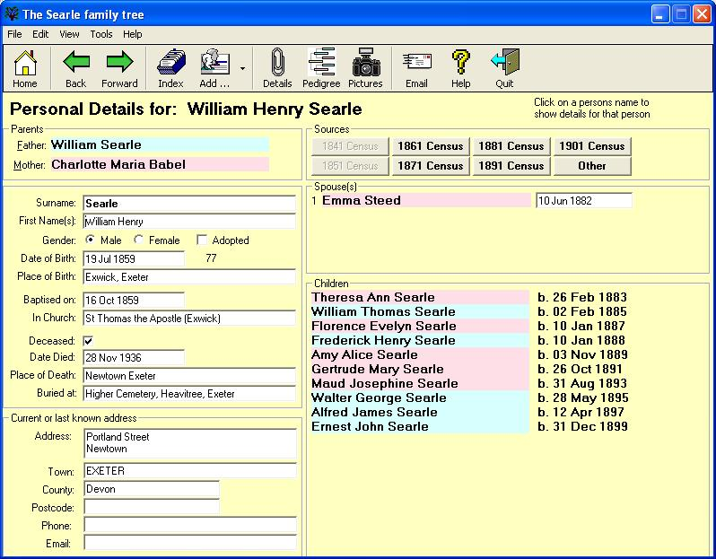



## Family Tree

### Description

This is a geneology program for entering your family tree. It's a complete working app but has no reports within it. You can add pictures and name the individuals in the pictures using a really cool frame and name technique. You can also add census information and lots more.
 
### More Info
 
Uses an Access database - you must have the Access database libraries to run this

             |
---                |---
**Submitted On**   |2004-10-29 09:40:14
**By**             |[Mike Searle](https://github.com/Planet-Source-Code/PSCIndex/blob/master/ByAuthor/mike-searle.md)
**Level**          |Advanced
**User Rating**    |4.8 (24 globes from 5 users)
**Compatibility**  |VB 6\.0
**Category**       |[Complete Applications](https://github.com/Planet-Source-Code/PSCIndex/blob/master/ByCategory/complete-applications__1-27.md)
**World**          |[Visual Basic](https://github.com/Planet-Source-Code/PSCIndex/blob/master/ByWorld/visual-basic.md)
**Archive File**   |[Family\_Tre1918237282005\.zip](https://github.com/Planet-Source-Code/mike-searle-family-tree__1-61933/archive/master.zip)

